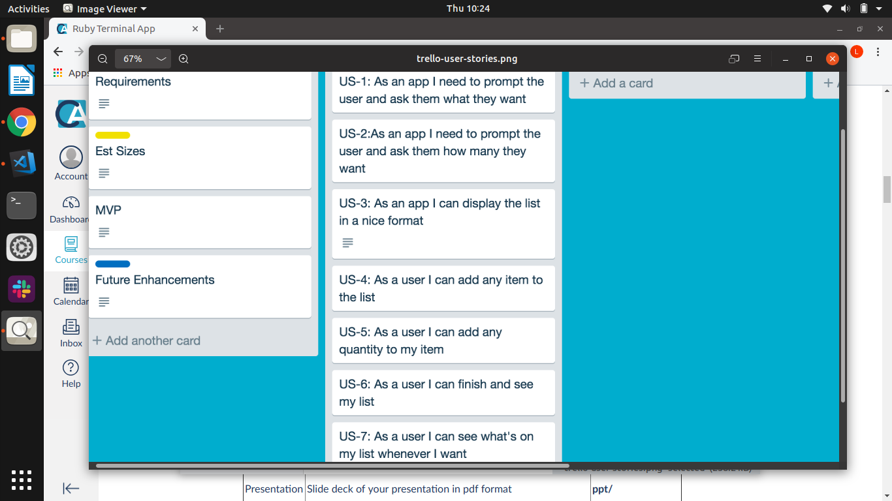

# Terminal-App-Assessment

## A Link to our GitHub Repository
Here's the link to our GitHub repository:

https://github.com/Lelani82/Terminal-App-Assessment

___________________________________________________________________________________________________________________________

## A Description of our App

### The Purpose of our App

The purpose of our app is to add your shopping items and their quantities, into a categorised list. This makes it easier for you to do your shopping online or instore.

### The Functionality of our App

In our app you can do the following:

● Add items, 

● Select a category (from a drop down menu),

● Add quantities, 

● Preview your current shopping list,

● View your final shopping list (which is sorted out by category).

### Instructions for Use

Step 1: Install the Gemfile Bundle

● In your Terminal type: bundle install

Step 2: Open the App in your Terminal

● In your Terminal type: ruby app.rb

Step 3: Follow the App's prompts

● Press (a) to add an item

● Press (p) to preview your current list

● Press (q) to quit and view your final shopping list

● Note: if you press any other key you will get an invalid option prompt and be redirected to enter one of the above options

Step 4: Seleting option 'a' - Adding an item to your shopping list

● The app will ask you what item you would like to add. Type in your item and press Enter.

● The app will ask you to choose your category. Use the arrow keys and press Enter). There are 5 categories to choose from:

○ Fruit and Veggies

○ Chilled and Frozen

○ Meat and Poultry

○ Bakery

○ Other

● The app will ask you how many you would like to add. Type in your quantity and press Enter.

● The app will take you back to Step 3 where you can continue to add more items, preview your current list or quit and view your final list.

Step 5: Seleting option 'p' - Previewing your current items in your shopping list

● The app will show you your current items in your shopping list. 

● The app will take you back to Step 3 where you can add more items, preview your current list again or quit and view your final list.

Step 6: Seleting option 'q' - Quiting and viewing your final shopping list (sorted by categories)

● The app will show you your final shopping list. It will display your items in their categories.

● This final step also exits you from the app.

### Screenshots of our App

● Please view the screenshots folder

### Future Enhancements of our App

Here is a list of possible future enhancements we have thought of:

● When printing the final list, only print the categories which include items (instead of printing a full list with empty categories)

● The option to delete an item fro your list

● The option to save your list to a YAML file 

● The option to update or edit your list

### Accessibility Concerns

We thought about how visually impaired people could possibly have difficulty when using our app. Possible solutions could include:

● Install a gem that converts text to speech; or 
● Using a screen reader

We also thought about the consequences of installing gems that could alter the text:

● Converting the text to flashing fonts - This would be inappropriate for people with epilepsy; or
● Converting the font to certain colours - This could be hard for people to read, so we considered our colour selection

### Potential legal, moral, ethical, cultural and safety issues
We have discussed these potential issues. The only possible issue we have come accross would be any legal implications associated with using an external Gem.

### Possible social, political, cultural, racial, gender and international issues
We have discussed these potential issues. The only possible issue we have come accross would be international usage of our app, where the country's main language is not English. This can easily be rectified by translating our apps prompts into a foreign language.

___________________________________________________________________________________________________________________________

## Details of our App Design & our Planning Process:

### Evidence of ​our app idea and brainstorming sessions

We considered a couple of different app ideas but ultimately chose the shopping list because:

● It was something we could both potentially use and 

● Due to time constraints, we dismissed our other larger, more complex app ideas

Screenshots can be viewed in docs/1-brainstorming folder

[brainstorming] (../docs/1-brainstorming/brainstorming-session.png)

### User stories of our App Design

We added the following user stories to our Trello Board:

● US-1: As an app I need to prompt the user and ask them what they want

● US-2: As an app I need to prompt the user and ask them how many they want

● US-3: As an app I can display the list in a nice format

● US-4: As a user I can add any item to the list

● US-5: As a user I can add any quantity to my item

● US-6: As a user I can finish and see my list

● US-7: As a user I can see what's on my list whenever I want

Screenshots can be viewed in docs/2-user-stories folder

 

### Our Project Plan & Timeline

We roughly broke up our timeline so that we could cover each of the following:

● Day 1: Brainstorming/ Seek approval/ Timeline/ Basic design concept/ Trello board

● Day 2: Review Trello board's to do list and user stories/ Started coding/ Test as we went along

● Day 3: Install Gem file/ Make app DRY/ Complete coding/ Continued with Trello Board/ Start with documentation/ Start with Power Point presentation/ Check Rubric criteria 

● Day 4: Final Day Goal/ Complete any outstanding tasks 

● Day 5: Due Date/ Final day to complete any outstanding tasks/ Submit Assessment

Screenshots can be viewed in docs/1-brainstorming folder

[brainstorming] (../docs/1-brainstorming/brainstorming-session)

### Description of Overall App Design (classes, files, basic flow)

●  We have 3 files which include 1 main and 2 class files. We chose to have 2 seperate class files to keep the main app uncluttered and easy to follow and edit. We chose to have all the categories listed in the main app so that it would be easy to update them if you chose to use it for a different type of store (like Bunnings)
●  The whole app is run from the main file and contains a main loop which prompts the user for their input (view screenshots folder)
●  For basic flow diagram please view the screenshots folder

Initial design specifications:

● Prompt user 

● User can add an item

● User can add a quantity

● User can repeat this process

● A list will appear when done

### Design considerations and choices

● 

Changes/ added - no prices, added categories, added preview option

### Screenshots of Trello board(s)

● Please view the screenshots folder